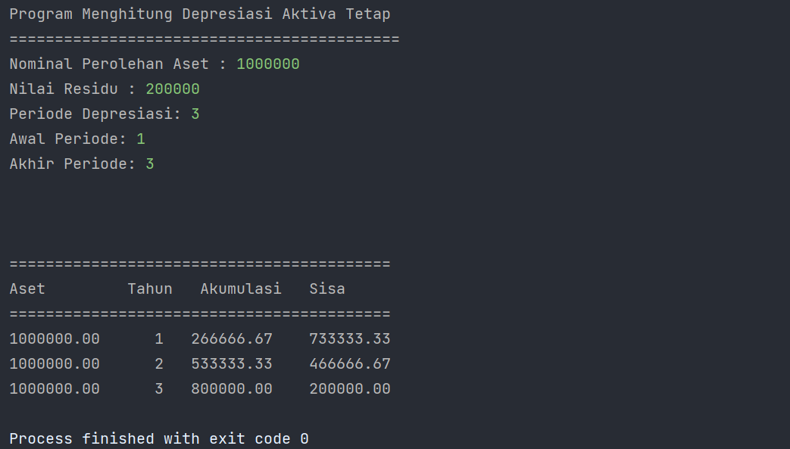

# Dokumentasi Program

### Saat Program dijalankan
- Pengguna diperintahkan untuk memasukkan beberapa nilai yaitu :
    - Nilai Aset
    - Nilai Residu
    - Periode Manfaat Aset / Periode Depresiasi
    - Awal Periode (Yang ingin ditampilkan di tabel)
    - Akhir Periode
- Maka akan tampil berupa tabel depresiasi tiap periode dari aktiva tetap.

## Letak Source Code

`Projek\src\com\company\Depresiasi.java`

# 

[Kembali ke menu awal repositori](README.md)